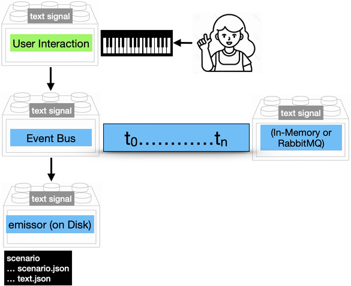
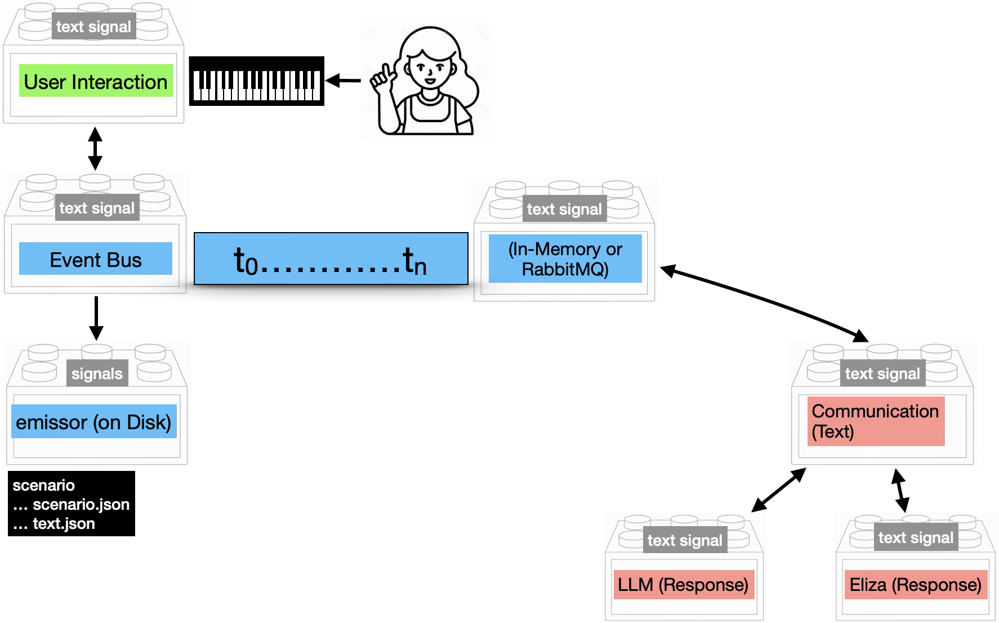
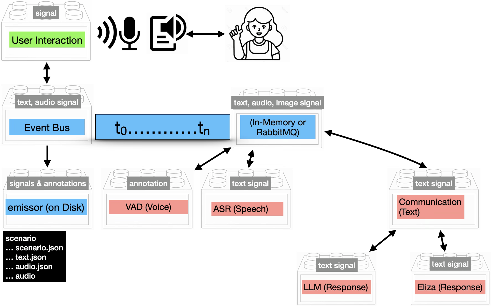
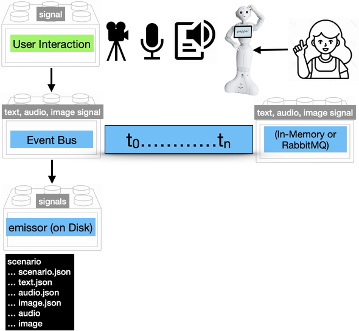
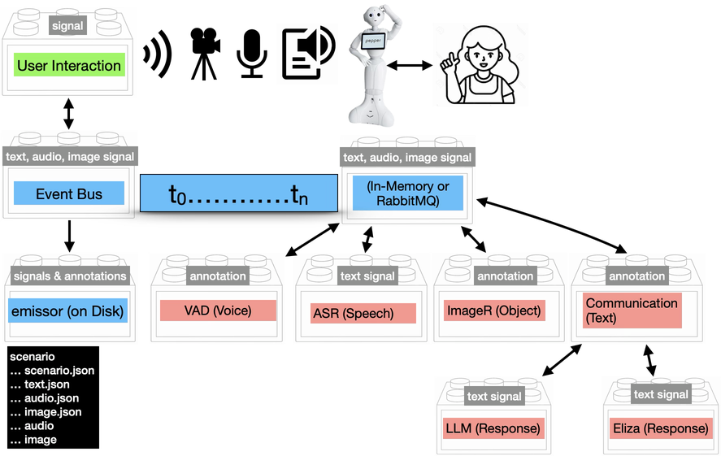
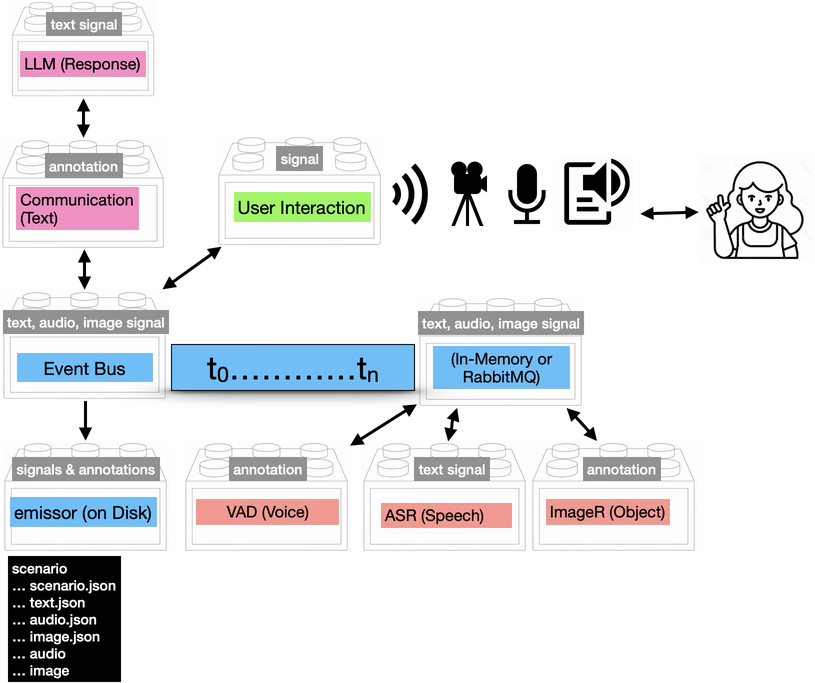
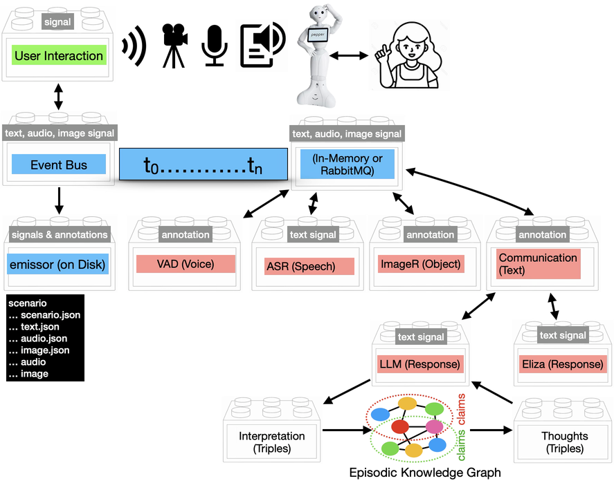

# The Leolani Platform

This repository contains a range of conversational agents built with the Leolani platform.
The agents all share the same Leolani core modules but have different add-on extension for generating the agent response, 
for dealing with multimodal input streams and for types of embodiment.

Below, we will first explain the overall architecture of the Leolani platform and next explain how different agents can be built from the building blocks.
Finally, we explain how you can integrate your own module to connect to the event-bus.

## Leolani architecture overview

The core module of Leolani is the ```event-bus```. The ```event-bus``` keeps track of incoming signals during a period of time for a specific scenario.
It uses a temporal ruler with a start time to keep track of any signals that are pushed at any moment in time. 
These signals are queued in memory and available for other modules to process, for example to generate an interpretation or a response.
In addition to keeping track of incoming signals, the scenario data are also recorded on disk using the ```emissor``` module. 
The ```emissor``` module saves the meta data for a scenario in a JSON file and any captured signals in a signal specific JSON file. 
When an interaction stops, the data is recorded in the ```emissor``` scenario and can be replayed.

### Text chat recording
The most simple variant of the Leolani architecture uses plain text signals that a user can type in a chat User Interface.
When started, a new scenario is initiated in the ```event-bus``` and the corresponding folder is created in ```emissor``` format on disk.
Each message that is typed by the user is saved as a ```Text signal``` in the event bus and also saved in the ```emissor text.json```.
The next image gives schematic overview of such an archtuecture that just records the text that a user enters:



For every Leolani application, we need a server for the ```event-bus``` and ```emissor``` and a client to capture the user interaction.
The user interaction is shown here at the top as a green component with a key-board input for the user through a chat User Interface (chat-ui). The blue boxes 
represent the server modules.


### Text chat application

The previous architecture only records text messages but does not respond. 
In order to turn this into a conversational agent, we need to add a module that can pull a signal form the ```event-bus``` and add another signal as a response.
In the next architecture, a text signal from the user that is passed through the event bus is picked up by a communication module that either gets a response from a Large Language Model (LLM) or from the Eliza module.
The response is a new ```Text Signal``` that is published on the ```event-bus``` and registered in ```emissor``` coming from the agent.


The ChatUI in the client program will listen to the ```event-bus``` for any ```Text Signal``` registered as a response and will display this to the user.

There are two chat-only applications in this repository one that uses Eliza to respond and the other that uses an LLM:

- docker-eliza-server
- docker-llm-server

Both servers can use the same chat-only client to get the user input and display the agent response:

- chat-client-app

#### Required components

User-interaction client:
- uai-client-context: creates a new interaction scenario and stops it
- uai-client-chatui: browser chat interface to enter and display text messages

Event-bus-server:
- rabbitmq (rabbitmq:3.12-management): keeps track of incoming and outgoing messages
- backend (ghcr.io/leolani/cltl-backend): event-bus module that captures the signals in a scenario
- emissor (ghcr.io/leolani/cltl-emissor-data): saving the scenario and signal data to disk
- communication module (one of then next two:
  - eliza (ghcr.io/leolani/cltl-eliza): uses keyword triggers and patterns to select a pre-stored response
  - llm: ghcr.io/leolani/cltl-llm: uses a generative LLM to respond

The components are available as a docker images. For each application architecture that is based on this basic architecture, there is a ```docker-compose.yml``` file 
for both the client and the server that specifies the needed docker images and other settings.

### Audio chat application

The above set-up can be augmented with speech processing modules such that a user can have a spoken dialogue instead of typed chat messages.
The global architecture for this is shown below:



First of all, the client app is extended with a local server at the client side that picks up audio from the microphone and accesses the speaker to output responses as speech.
The client can send typed messages and audio signals to the event bus.

At the server side, the ```even-bus``` module is extended with two more processing modules: voice-activity-detection (VAD) and automated-speech-recognition (ASR). The VAD module
waits for audio signals in the event bus. Each audio signal is checked for voice activity. 
If a human voice is detected, the module publishes an annotation of the audio signal marking the beginning and end of the speech.
The ASR module is configured to read audio signals and voice annotations to apply speech recognition. The recognised speech is converted to text and pusblished as a text signal.
Next the text signal is picked up by the communication module to create an agent response, just as with the chat variant described previously.
Also notice that the ```emissor``` module now stores both text and audio signals with their annotations on disk. The ```audio``` folder stores all audio data as ```wav``` files. 

At the client side, the application waits for text signals as a response from the agent. In this cases, they are not only displayed in the chat UI but also rendered as speech through the speaker.

This architecture loads additional docker images with respect to the previous set up, both for the client and the server:


### Data elements


Multimodal input is captured through camera, microphone and text channels:



##### Audio chat response


##### Audio and image chat response

Combining audio and image input, processed through VAD, ASR and ImageR:





The full set of client modules, covering voice activity detection (VAD), speech recognition (ASR), image recognition (ImageR) and response generation (LLM / Eliza):


#### Annotations

Annotations, such as interpretations and thoughts, are represented as triples and combined into a knowledge graph of claims:


