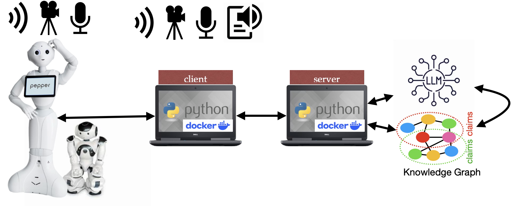

# Leolani agents

This repository contains a range of conversational agents built with the Leolani platform.
Some agents use the classical Eliza program to respond to user input, others use a generative Large Language Model (LLM)
and yet others reason over a Knowledge Graph to generate a response. Furthermore, the agents can deal with chat, audio and image signals 
and can connect to any external LLM.

We will explain the core of the Leolani platform first and, next, the architectures of the different conversational agents and how they can be built by extending the core installation. 
Each agent consists of a client application that allows the user to interact and a server application that processes the user input
to generate a response. The client  and the agent can run on the same or on different machines. 
Finally, the client can be a browser user interface to chat and/or use the microphone or camera of the local device where the client runs. 
However, the client can also connect with an embodiment such as a robot. The next image shows a high-level overview of the possible
client-server-embodiment set-ups:



*Figure 1: High-level overview of the client-server-embodiment set-ups.*

The two laptops represent the client and the server installation, based on Docker images and possible Python code. 
The client will pick up input from the user, either from the device where the client runs (keyboard, Mic, camera) or through an embodiment (camera, Mic).
The input signals are sent to the server for further processing. The server may consult a Large Language Model (LLM), a Knowledge Graph (KG) or a neuro-symbolic combination.
The response is sent back to the client and rendered either on the client machine (speaker or chat) or the embodiment (speaker, gesture).

The agents all share the same Leolani core modules but have different add-on extensions for processing input signals and 
generating the agent response. The core module and the agents components are available as Docker images that can be combined. 

It is possible to develop your own module and your own agent application on top of the docker components. 
Below, we will first explain the overall architecture of the Leolani platform with the core modules and, next, explain how different agents can be built from the building blocks.
Finally, we explain how you can make your own module to run in the client machine in combination with the server to process signals.

1. Prerequisites
2. Overall Leolani architecture
3. Text chat application
4. Audio chat application
5. Audio and Image chat application
6. Knowledge Graph Integration
7. Adding your own module 
8. Creating a pipeline


## 1. Prerequisites

All the architectures described below require that [Docker](https://docs.docker.com/engine/install/) is installed:
```
| Requirement    | Minimum version | Notes |
|----------------|-----------------|-------|
| Docker         | 23.0            |       |
| Docker Compose | 2.10            |       |
```

Furthermore, clone the current repository somewhere on Disk:

```commandline
git clone git@github.com:leolani/cltl-apps.git
```

## 2. Overall Leolani architecture

The core module of Leolani is the ```event-bus``` that keeps track of incoming signals during for a specific scenario.
It uses a temporal ruler with a start time to keep track of any signals that are pushed at any moment in time. 
These signals are queued in memory and available for other modules to process, such as to generate an interpretation or a response.
In addition to keeping track of incoming signals in memory, the signals and their interpretations are also recorded on disk using the ```emissor``` module. 
The ```emissor``` module saves the metadata for a scenario in a JSON file and any captured signals in a signal specific JSON file. 

The Leolani core architecture would simply record plain text signals that a user types in a chat User Interface. It works as follows.
When started, a new scenario is initiated in the ```event-bus``` and the corresponding folder is created in ```emissor``` on disk.
Each message that is typed by the user is saved as a ```Text signal``` in the event bus and also saved in ```emissor``` in a file ```text.json```.
The next image gives schematic overview of such an architecture that just records the text that a user enters:


*Figure 2: Basic architecture that records text signals via the event-bus and emissor.*

For every Leolani application, we need a server for the ```event-bus``` and ```emissor``` and a client to capture the user interaction.
The user interaction is shown here at the top as a green component with a key-board input for the user through a chat User Interface (chat-ui). The blue boxes 
represent the server modules.

## 3. Text chat application

The previous architecture only records text messages but does not respond. 
In order to turn this into a conversational agent, we need to add a module that can pull a signal form the ```event-bus``` and publish a new signal as a response.
In the next architecture (Figure 3), a text signal from the user that is passed through the event bus is picked up by a communication module that either gets a response from a Large Language Model (LLM) or from the Eliza module.
The response is a new ```Text Signal``` that is published on the ```event-bus``` and registered in ```emissor's text.json``` with the agent as a source:


*Figure 3: Text chat architecture where a communication module generates a response via the LLM or Eliza module.*

The ChatUI in the client program will listen to the ```event-bus``` for any ```Text Signal``` registered as a response from the agent and will display this to the user.
Figure 3 shows how the client and server applications are separated. They can run on the same machine or on different machines.
If the server is installed on a remote machine the URL mappings from client to server need to be adapted to make a connection (see below).

There are two chat-only server applications in this repository one that uses Eliza to respond and the other that uses an LLM:

- docker-eliza-server
- docker-llm-server

Both servers use the same chat-only client to get the user input and display the agent response:

- docker-chat-client-app

The client and the servers are available as Docker images:

### Docker images

*User-interaction client*:
- uai-client-backend (ghcr.io/leolani/cltl-backend): 
- uai-client-context (ghcr.io/leolani/cltl-context): creates a new interaction scenario and stops it
- uai-client-chatui (ghcr.io/leolani/cltl-chat-ui): browser chat interface to enter and display text messages

*Event-bus-server*:
- rabbitmq (rabbitmq:3.12-management): keeps track of incoming and outgoing messages
- backend (ghcr.io/leolani/cltl-backend): event-bus module that captures the signals in a scenario
- emissor (ghcr.io/leolani/cltl-emissor-data): saving the scenario and signal data to disk
- communication module (one of the next two):
  - eliza (ghcr.io/leolani/cltl-eliza): uses keyword triggers and patterns to select a pre-stored response
  - llm (ghcr.io/leolani/cltl-llm): uses a generative LLM to respond

The client and server directories contain a ```docker-compose.yml``` file that defines the Docker images needed and any other settings.

### How to run ELIZA-chat from the command line:

**i. Launch the server:**
```commandline
cd docker-eliza-server
docker compose up
```

The ```docker compose up``` command uses the docker-compose.yml file to load the images from DockerHub and set the configuration for the server.
The first time you run it, the images need to be downloaded from the web and the application needs to be constructed on your server machine.
The next time you run it, it checks if there are updates for the images. If so, the latest version is pulled from the web.
Otherwise, the local installation is launched immediately. Pulling the images may take some time depending on the speed of the Internet connection.

**ii. Launch the client:**

The client is also a Docker image that is loaded and launched through the ```docker-compose.yml``` file in the client folder.
When the server is running, you can fire up the client Docker image in another terminal:

```commandline
cd docker-client
docker compose up
```

**iii. Open the chaUI:**

If both the server and client are stable, open a web browser with the following address:

```url
http://localhost:8003/chatui/static/chat.html
```

You will see a chat interface in which the conversation is displayed. 
See the [README](../docker-client/README.md)) of the ```docker client``` for further details.

You stop the application using CTRL-C in the server and client terminal and by closing the web browser TAB.

## 4. Audio chat application

The above set-up can only be used to chat. We can now augment this architecture with speech processing such that a user can have a spoken dialogue instead of typed chat messages.
The global architecture for this is shown below:


*Figure 4: Audio chat architecture extended with voice-activity-detection (VAD) and automated-speech-recognition (ASR).*

First of all, the client app is extended with a so-called ```backend server``` at the client side that picks up audio from the microphone and accesses the speaker to output responses as speech.
Note that the chat option also remains available. The user can type messages and speak and responses are shown as text and spoken.

At the server side, the ```even-bus``` module is now extended with two audio processing modules: voice-activity-detection (VAD) and automated-speech-recognition (ASR). 
The VAD module waits for audio signals in the event bus. Each audio signal is checked for voice activity. 
If a human voice is detected, the module creates an annotation of the audio signal marking the beginning and end of the speech. 
An annotation of a signal is published on the event-bus as metadata about another signal. It typically defines a segment of a signal and an interpretation label.

The ASR module is configured to read audio signals and voice metadata annotation to apply speech recognition to the defined segment. 
The human speech is converted to text and pusblished to the event bus as the input Text Signal for further processing.
This input Text Signal is next picked up by the communication module to get an agent response, just as with the chat variant described previously.
This response is published as a new output Text Sginal.
Notice that the ```emissor``` module stores both text and audio signals with their annotations on disk in the ```text.json``` and the ```audio.json```. 
The ```audio``` folder stores all the raw audio fragments as unique ```wav``` files. 

At the client side, the application waits for output Text Signals as agent responses. In this cases, they are not only displayed in the chat UI but also rendered as speech through the speaker.

This architecture needs additional Docker images for new modules of the server and a separate installation of the backend server for the client that picks up audio signals:

User-interaction client:
- run_host_server.sh

Event-bus-server:
- (ghcr.io/leolani/cltl-vad)
- (ghcr.io/leolani/cltl-asr)

###  Additional requirements

In addition to the Docker images, this application also needs the following to run the backend server that captures the audio from the microphone:

| Requirement | Minimum version | Notes |
| Python | 3.8+ | For the host backend server (audio capture) |
| PortAudio | — | `portaudio19-dev` on Debian/Ubuntu; `portaudio` via Homebrew on macOS |

### How to run ELIZA-talk from the command line:

**i. Launch the server:**
```commandline
cd docker-eliza-server
docker compose up
```

**ii. Launch the client:**

Before we launch the Docker image for the client, we now need to run a server on the local machine to capture the audio signals.
The installation and launch of the server needs to be done in a separate terminal through the ```run_host_sever.sh``` script that
can be found in the client folder:

```commandline
cd docker-client
./run_host_server.sh
```

When the servers are running, you can fire up the client Docker image in another terminal:

```commandline
cd docker-client
docker compose up
```
**iii. Open the chaUI:**
```url
http://localhost:8003/chatui/static/chat.html
```
See the [README](../docker-client/README.md)) of the ```docker client``` for further details.


## 5. Audio and image 

Combining audio and image input, processed through VAD, ASR and ImageR:

Multimodal input is captured through camera, microphone and text channels:


*Figure 5: Multimodal input captured through camera, microphone and text channels.*

The full set of client modules, covering voice activity detection (VAD), speech recognition (ASR), image recognition (ImageR) and response generation (LLM / Eliza):

## 6. Knowledge Graph integration

Annotations, such as interpretations and thoughts, are represented as triples and combined into a knowledge graph of claims:


*Figure 6: Knowledge graph representation of interpretations and thoughts as claims.*

This architecture only requires a Knowledge Graph server and the ```docker-kg-server``` to be launched with the right connection settings to the Knowledge Graph.
As a Knowledge Graphe server, we use GraphDB:

2. Download [GraphDB](http://graphdb.ontotext.com/)
2. Launch it
3. Create a repository, you can use [this configuration](https://github.com/leolani/cltl-knowledgerepresentation/blob/main/src/cltl/brain/ontologies/BASIC-REPOSITORY-CONFIG-GRAPHDB.ttl)

## 7. Adding your own module

Modules to process signals are registered at the server side and run on the server machine. 
It is also possible to develop your own module and run it locally.
This module checks the event-bus for any signals or annotations that it requires as input.
It will pull the data from the event-bus, process it an push back a signal or annotation to the event-bus,
where other modules can take it up again untill it eventually ends up as a response in the client UI.

An example of such an architecture is shown in the next Figure, where the communication module runs locally on the client machine
and calls an LLM to interpret the data that is pulled from the event bus:


*Figure 7: Local client modules that connect to the event-bus.*

## 8. Creating a pipeline

The processing modules that operate on the event-bus run independently in separate threads. 
To form a pipeline, the event-bus server registers the modules as so-called ```Topic Workers``` in a configuration file.
The input and output of each module is defined as a ```topic``` with a name. 
By aligning the input name of a module with the output of another module, a pipeline connection can be created.
For example:

```commandline

```
Details of the pipeline architecture are explained in [Baier et al 2026](https://journals.uic.edu/ojs/index.php/dad/article/view/13303).

## Citation
If you use these applications or the EMISSOR framework in your research, please cite:

@article{baier2025modular,
  title={A modular architecture for creating multimodal embodied agents with an episodic Knowledge Graph as an explainable and controllable long-term memory},
  author={Baier, Thomas and Santamar{\'\i}a, Selene B{\'a}ez and Vossen, Piek},
  journal={Dialogue \& Discourse},
  volume={16},
  number={3},
  pages={25--59},
  year={2025}
}
@inproceedings{emissor:2021,
    title = {EMISSOR: A platform for capturing multimodal interactions as Episodic Memories and Interpretations with Situated Scenario-based Ontological References},
    author = {Selene Baez Santamaria and Thomas Baier and Taewoon Kim and Lea Krause and Jaap Kruijt and Piek Vossen},
    url = {https://mmsr-workshop.github.io/programme},
    booktitle = {Proceedings of the MMSR workshop "Beyond Language: Multimodal Semantic Representations", IWSC2021},
    year = {2021}
}

_
